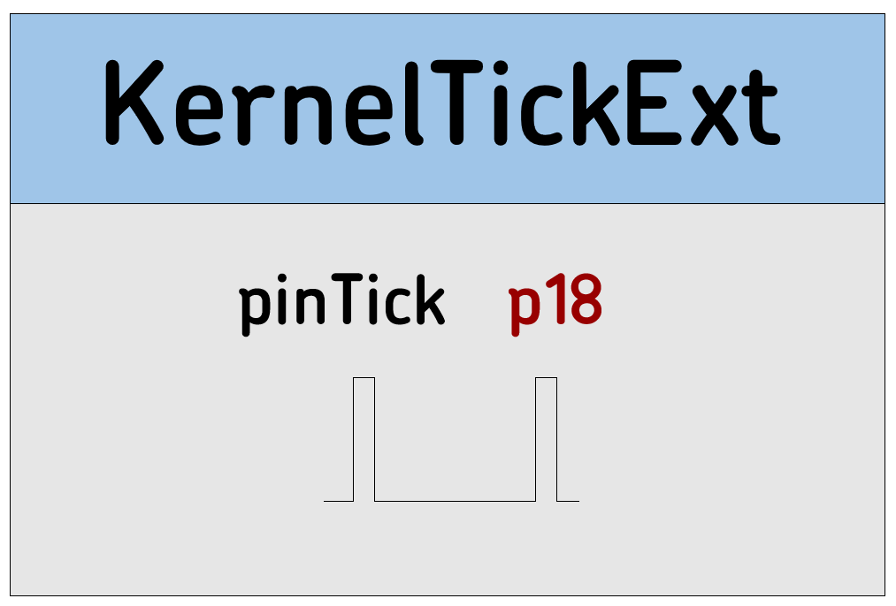

# KernelTickExt

Configures the nBlocksStudio Kernel to use an external pin for the`Tick` instead a timer

<p align="center">

</p>  
  

----

>  *  Category: Configuration
>  *  HAL: mbed
>  *  Tested: with LPC1768
>  *  Author: N. Chalikias

## Implementation Details
This is a configuration Node without any connections.


## input/Output Connections ##

```
 -  No connections
```

## Node Parameters ##

```
 -  PinName:  Pin to be used for `Tick` source


```


## Usage Example ##

```
[KernelTickExt]
[Other]-->[Other]

```


